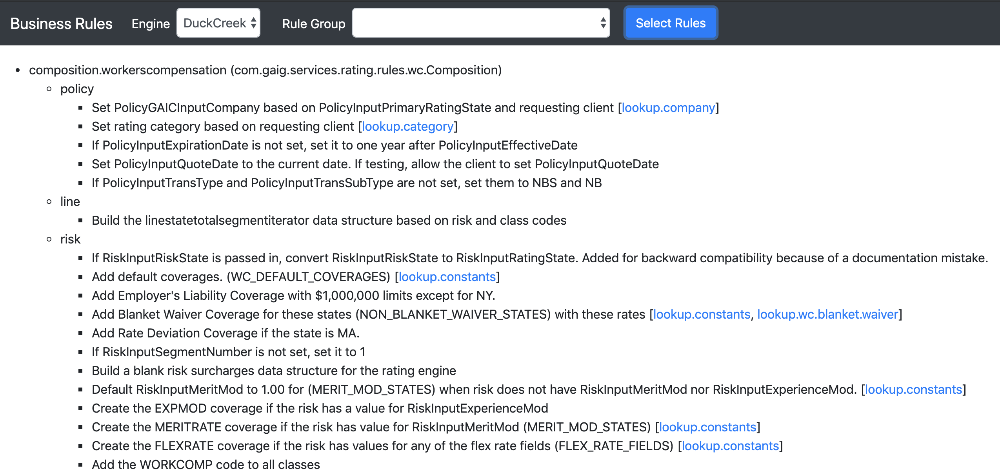

# Enterprise Rules Engine
The enterprise rules engine is a library for orchestrating, executing, and documenting business rules.
Start using the rules engine  by following these simple steps:  
1. [Import the library](#import-library)  
2. [Define rules](#define-rules)
3. [Define rule groups and categories](#define-rule-groups)  
4. [Define rule orchestration](#define-orchestration)  
5. [Execute the rules](#execute-rules)
6. [View rule documentation](#rule-documentation)  

Finally, review some [important concepts](#important-concepts) for writing rules.


## <a name="import-library"></a> Import the library  
##### Gradle
```groovy
implementation("com.gaig.services:rules-engine:$version")
```

##### Maven
```xml
<dependency>
  <groupId>com.gaig.services</groupId>
  <artifactId>rules-engine</artifactId>
  <version>${version}</version>
</dependency>
```

##### Required Spring Properties (application.yml)
```yaml
ncube:
  target:
    host: ncube.gaig.com
    port: 443
    scheme: https
    username: <ncube_username>
    password: <ncube_password>
  rules:
    engines:
    -  
      name: <required> Unique name for the rules engine
      tenant: <optional> NCube ApplicationID tenant - defaults to NONE
      app: <required> NCube ApplicationID app
      version: <required> NCube ApplicationID version
      status: <optional> NCube ApplicationID status - defaults to RELEASE
      branch: <optional> NCube ApplicationID branch - defaults to HEAD
      rules: <required> NCube name where rules are defined
      categories: <optional> NCube name where categories are defined
spring:
  profiles:
    active: ncube-client
```


## <a name="define-rules"></a> Define rules
Rules are defined as methods on a rule class.
- Create one or more rule classes that extend [BusinessRule](src/main/groovy/com/cedarsoftware/ncube/rules/BusinessRule.groovy)
- Document rules (methods and classes) using [@Documentation](src/main/groovy/com/cedarsoftware/ncube/rules/Documentation.groovy) 

##### BusinessRule Member Variables
- `List<RulesError> errors` - list for accumulating errors generated by rules
- `Object root` - primary root of a graph that rules operate on
- `Map input` - NCube input available to the rule class and NCubes
- `Map output` - NCube output available to the rule class and NCubes
- `ApplicationID appId` - NCube ApplicationID associated with the rules engine

##### Rule Class Examples 
- [Transformation Rules](src/test/groovy/com/cedarsoftware/ncube/rules/examples/Transform.java)  
- [Validation Rules](src/test/groovy/com/cedarsoftware/ncube/rules/examples/Validate.java)  


## <a name="define-rule-groups"></a> Define rule groups and categories
Rule groups and rule categories are defined in NCubes.  

#### Rule Groups
A rule group is the unique combination of a rule class and a rule orchestration.
An NCube used to define rule groups must have the following:
- Axis `ruleGroup`, type `DISCRETE`, data type `STRING` or `CISTRING`
  - Columns - set to unique rule group names
- Axis `attribute`, type `DISCRETE`, data type `STRING` or `CISTRING`
  - Columns `className`, `ncube`, and `throwException`

The `className` cells should contain a String of the fully qualified class name.  
The `ncube` cells should contain a String of the name of the NCube where the rules are orchestrated.  
The `throwException` column is optional. Cells should be true if the rule group should throw a `RulesException` if any errors are recorded.  
No cells should be empty.  

##### Example rule groups


#### Rule Categories (optional)
Rule categories are used to select rule groups based on metadata about the rule groups. For example, the category 
`phase` might used to categorize rule groups as either `pre-rating` or `post-rating`. Other example of ways to categorize
rules might be by product (workers compensation, commercial auto, etc.) or by mutability (mutable or immutable).

An NCube used to define rule categories must have the following:
- Axis `ruleGroup`, type `DISCRETE`, data type `STRING` or `CISTRING`
- Axis `category`, type `DISCRETE`, data type `STRING` or `CISTRING`

The cells should contain the value of the associated category.  
It is permissible to leave cells empty.  
All rule groups need not be defined with rule categories. If they are defined with categories, the rule group names must match those in the rule group NCube.  

##### Example rule categories


## <a name="define-orchestration"></a> Define rule orchestration 
Rule orchestrations are defined in NCubes. 
A rule orchestration defines the order in which rules should be executed and the path of the graph being traversed.
An NCube used to define a rule orchestration must have the following:
- Axis `rule`, type `RULE`, data type `EXPRESSION`, check `Fire all matching`

Cells may contain simple references to rules.  
The rule class defined in the rule groups NCube gets put on `input.rule` so that rule methods can be called easily.  
Cells may reference other orchestration NCubes.  
Cells may contain code, including looping and referencing other NCubes.  

##### Example simple rule orchestration
- In this example, the first five cells show simple rule executions.  
- The last cell shows a reference to another orchestration NCube where the orchestration will continue traversing the graph.  


##### Example rule orchestration with looping
- The first cell shows a rule execution.  
- The second cell shows code that performs looping on a structure of the 'root' object (in this case a List of Maps.)  


## <a name="execute-rules"></a> Execute the rules
Rules are executed by specifying one of the following:
- A single rule group - `String` (does not use rule categories)
- A list of rule groups, in list order - `List<String>` (does not use rule categories)
- Selected categories, in NCube defined order - Groovy `Closure`
- Selected categories, in NCube defined order - `Map<String, Object>`
- Selected categories, in list order then NCube defined order - `List<Map<String, Object>>`

```java 
rulesEngine.execute(<one of the above types>, root, input, ouput);
```

##### Example rule executions
[Demo](src/test/groovy/com/cedarsoftware/ncube/rules/examples/Demo.java)

If any errors are recorded while executing rules, a `RulesException` will be thrown after each rule group containing all the errors.

## <a name="rule-documentation"></a> View rule documentation  
Simply navigate to `/rules.html` from the base URL where the rules are running.



## <a name="important-concepts"></a> Important concepts
#### Mutable vs. immutable rules  
When defining rule types, it is best practice to not mix mutable rules with immutable rules. Define mutable rules and 
immutable rules in separate rule groups.

#### Stop between rule groups 
Currently, there is a hard stop between rule groups if any errors are recorded while executing rules within a rule group.
This can be useful to stop executing rules if rules in a second group rely on the successful completion of rules in the
first group.  

#### NCube input and output  
The `input` and `output` maps used by NCube are added as member variables of the base class `BusinessRule`.
Rating/pricing rules, for example, may have multiple outputs including prices, sub-totals, rates, etc. which can be stored on `output`. 


